# Ability System
This page will serve as an manual to how the Ability System functions in LobsterFramework.

# Contents
- [Intro](#intro)
- [Basics](#basics)
    - [Example 1](#example-1)
        - [Ability Manager & Ability Data](#ability-manager--ability-data)
        - [Defining Abilities & Editing Properties](#defining-abilities--editing-properties)
        - [Invoke Ability](#invoke-ability)
    - [Example 2](#example-2)
        - [Ability Instance - Config, Channel & Context](#ability-instance---config-channel--context)
        - [Acquire Component Reference](#acquire-component-reference)
        - [Initialization & Finalization Routines](#initialization--finalization-routines)
    - [Example 3](#example-3)
        - [Edit Multiple Abilities In The Inspector](#edit-multiple-abilities-in-the-inspector)
        - [Ability Component](#ability-component)
        - [Enforce the Requirement](#enforce-the-requirement)
    - [Example 4](#example-4)
        - [Ability Condition](#ability-condition)
        - [Prepare & Reset Ability Context](#prepare--reset-ability-context)
        - [Interrupt & Stop Ability](#interrupt--stop-ability)
- [Coroutine](#coroutine)
- [Glossary](#glossary)

# Intro
Before we begin, it is necessary to clarify what kind of ability system we're dealing with here. The idea is directly taken from League of Legends, a MOBA game of 10 where each player play as a champion with a couple unique abilities. Here're some observations.

1. Most abilities have cooldowns which represents the amount of time it'll take for them to be available to cast again. 
2. Some abilities can be interacted with after the initial cast.
3. Each ability's effect is somewhat unique, but the extent of these effects (i.e. how much health is restored on a healing spell) is governed by a set of champion stats (Attack Damage, Ability Power, etc) that is shared by all champions. 
4. Some abilities feature effects that is affected by stats/resources that only exists on certain champions. 
5. Abilities can be interrupted
6. Abilities have priorities. When 2 champions each cast a unique ability that is able to cancel the other champion's ability cast on each other, the outcome is the ability with higher priority goes through and cancels the other.  
7. Some abilities can be toggled on/off

There're some other features I will not go in detail here. Overall, based on these observations, the design goal is for it to have the following properties:
- Ability can have unique attributes
- Ability can have unfixed duration at runtime
- Data can be shared between abilities
- Ability can be evaluated in a certain order to avoid race condition
- Ability can be interrupted
- Ability can react to events
- Ability can receive input and produce output while running
- Configurable ability settings, the configuration can be saved assets and should act like other assets and be used by any entity.
- Editor Support: Having custom inspector that allows developers to easily configure ability settings 
- Code-Backed & Single Threaded. All abilities and the associated parts should be implemented with code. Although developers can edit abilities settings in the inspector, this system is not intended for creation of abilities inside unity editor.

# Basics
The following examples will demonstrate how to use the ability system in your project.
## Example 1
### Ability Manager & Ability Data
Start in a simple scene with our character.  
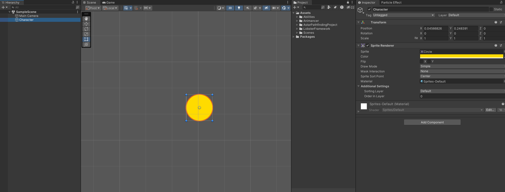
We want our character to cast abilities, to do that, we'll add the [AbilityManager](#abilitymanager) component. This component requires an [AbilityData](#abilitydata) as input, which defines the set of abilities our character will have access to.
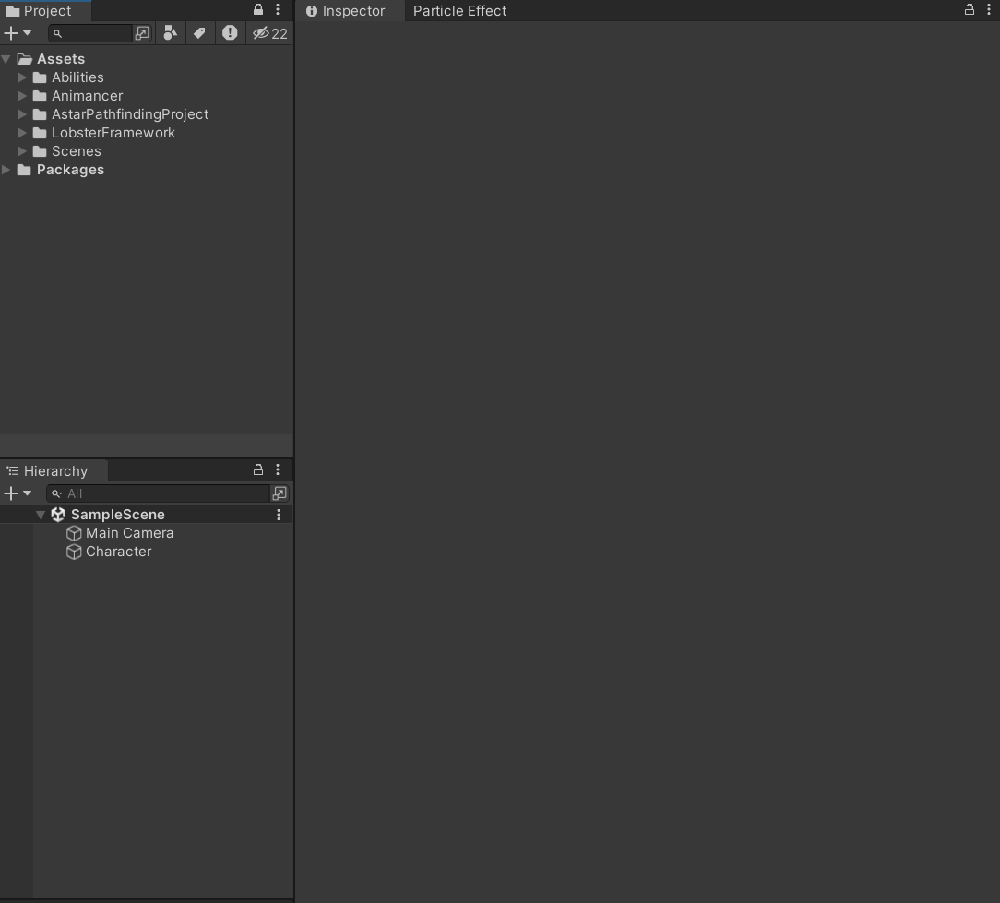 
### Defining Abilities & Editing Properties
Now that there's not much going on as we haven't defined our abilities yet! Let's start with this simple definition of `CircleAttack`.
``` 
using LobsterFramework.AbilitySystem;
using UnityEngine;

[AddAbilityMenu]
public sealed class CircleAttack : Ability
{
    protected override bool Action()
    {
        Debug.Log("Attack!");
        /* Code to deal damage to the enemy */
        return false; 
    }
}
public class CircleAttackConfig : AbilityConfig { }
public class CircleAttackChannel : AbilityChannel { }
public class CircleAttackContext : AbilityContext { }
```
Defining an ability is really simple! The only thing we are required to do is implement `Ability.Action()` method. This method will be called during ability invokation, which occurs during the `LateUpdate()` unity event, and will continously be called every frame until the method returns false. Currently our ability immediately terminates after dealing damage to the enemy.

Make sure the `[AddAbilityMenu]` attribute is applied and the bottom 3 classes match the names letter by letter in the example. The former makes the ability definition visible to the ability system and it will then use reflection to search for and validate the definition of these 3 supplementary classes. We'll talk about those later in other examples. We should now be able to see the option to add this ability to the `data` asset we created moments ago when we open the editor. Also, the ability system requires all abilities that are instantiable to be `sealed` for safety concerns.
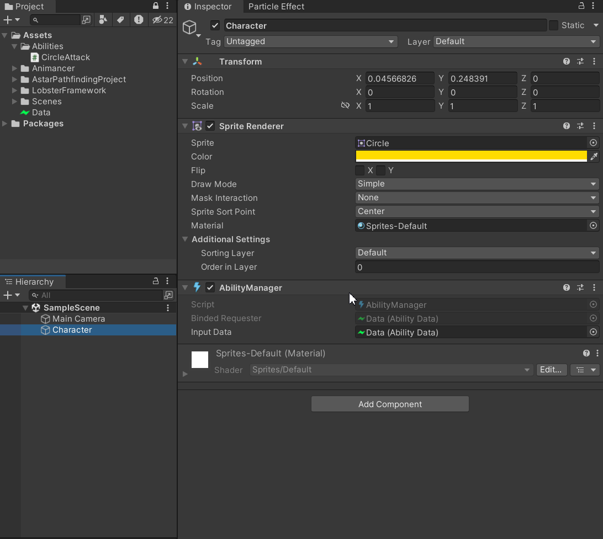
Here inside the inspector we can edit ability settings. Currently the only thing we can edit is the cooldown and execution priorities of the ability. The former determines the frequency the ability can be casted and the latter dictates the order of invokation of this ability during the `LateUpdate()` Unity event. The higher the priority, the earlier the ability will be executed in relation to other abilities. We can also define our own properties of the ability that can be edited in the inspector. Take a look a the extended definition of `CircleAttackConfig`:
```
using LobsterFramework.AbilitySystem;

public class CircleAttackConfig : AbilityConfig {
    public int AttackDamage;
}
```
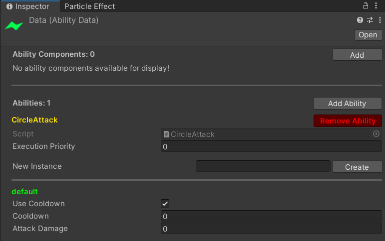
The newly added field `AttackDamage` can now be edited inside the inspector. Note that we have moved `CircleAttackConfig` out as a separate file from `CircleAttack.cs` since unity has trouble displaying editor for multiple classes defined in the same file and will throw warnings.

To access the newly added data field from `CircleAttack`, we need to use the variable `Ability.Config`:
```
using LobsterFramework.AbilitySystem;
using UnityEngine;

[AddAbilityMenu]
public sealed class CircleAttack : Ability
{
    protected override bool Action()
    {
        CircleAttackConfig config = Config as CircleAttackConfig;
        Debug.Log($"Attack for damage {config.AttackDamage}!");
        /* Code to deal damage to the enemy */
        return false; 
    }
}

public class CircleAttackChannel : AbilityChannel { }
public class CircleAttackContext : AbilityContext { }
```
### Invoke Ability
Time to put it all together! We are going to cast this ability through the `AbilityManager` component we just added to our character. Let's create a simple player controller component and map it with mouse left click using the unity input system.
```
using LobsterFramework.AbilitySystem;
using UnityEngine;

public class PlayerControl : MonoBehaviour
{
    [SerializeField] private AbilityManager abilityManager;
    public void Attack() { 
        abilityManager.EnqueueAbility<CircleAttack>();
    }
}
```
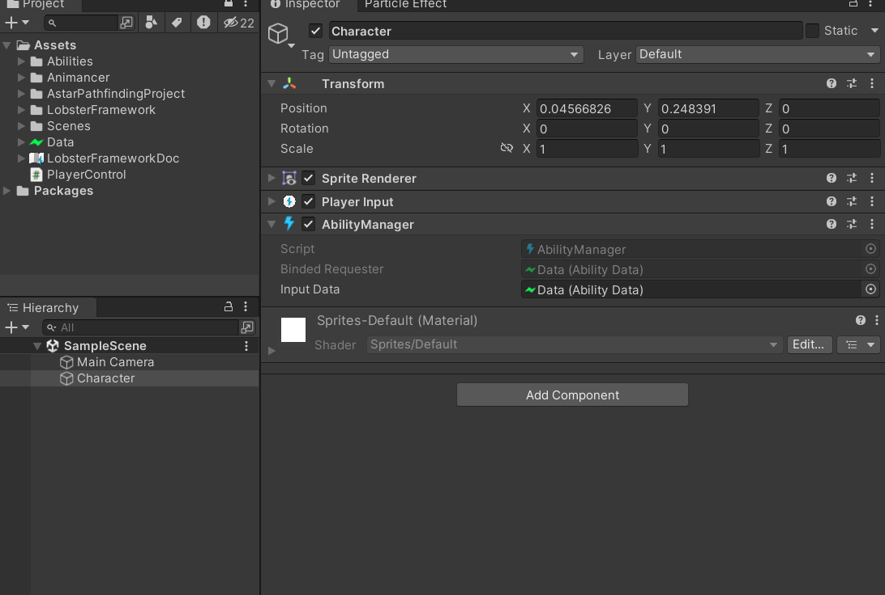
When we enter playmode and spam left clicks, we can see the output of the ability on the console. Additionally, we can use `AbilityManager` inspector to edit ability data in real time. The changes won't get saved to the disk unless the `Save` button is clicked. You can also use `Save As` button to store a copy of the `AbilityData` somewhere else.
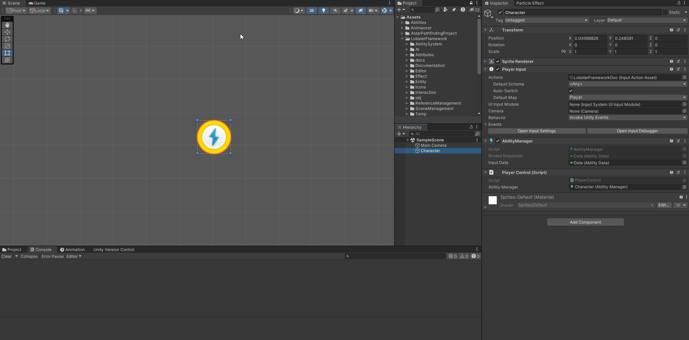

## Example 2
### Ability Instance - Config, Channel & Context
In some cases we want our character to be able to cast the same ability with different settings in 1 play session, such as shooting different bullets from the weapon, or throwing out punches with different strength. We would need to define an ability for each variation that has the same behavior but only differs in parameters, which is not ideal. Here we introduce the concept of *ability instance* to help us solve this issue.

 An ability is allowed to have multiple instances running at the same time. The number of instances allowed for each ability is equal to the number of configurations defined for the ability. It consists of a [configuration of the ability](#abilityconfig), a [communication channel](#abilitychannel) that allows for sending input and reading output from the ability while it's executing and a [context object](#abilitycontext) that holds all of the temporary variables during its execution. These directly corresponds to `Ability.Config`, `Ability.Channel` and `Ability.Context` variables that we have access during ability callbacks. At runtime, we can choose any ability instance we have created to run, or multiple of them when necessary as they're independant from each other. Let's take a look how things are put together in action! Continuing from our last example, we have this simple scene setup:
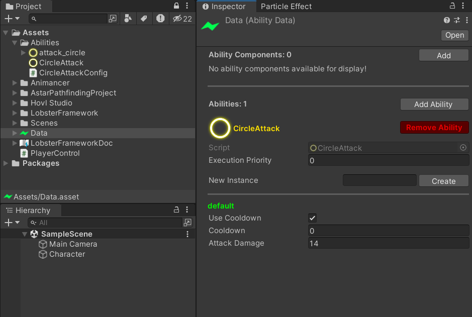
In case you're wondering, you can assign icon to your ability script to have it displayed in the inspector for visual clarity. Here we have a particle system attached to our character, we will use it to draw particle effect as our ability effect. We want to be able to choose from 2 different colors to draw the particle effect in play mode. The [AbilityData](#abilitydata) editor allows us to create & edit configurations for ability instances. We will start by creating a new configuration for our ability:
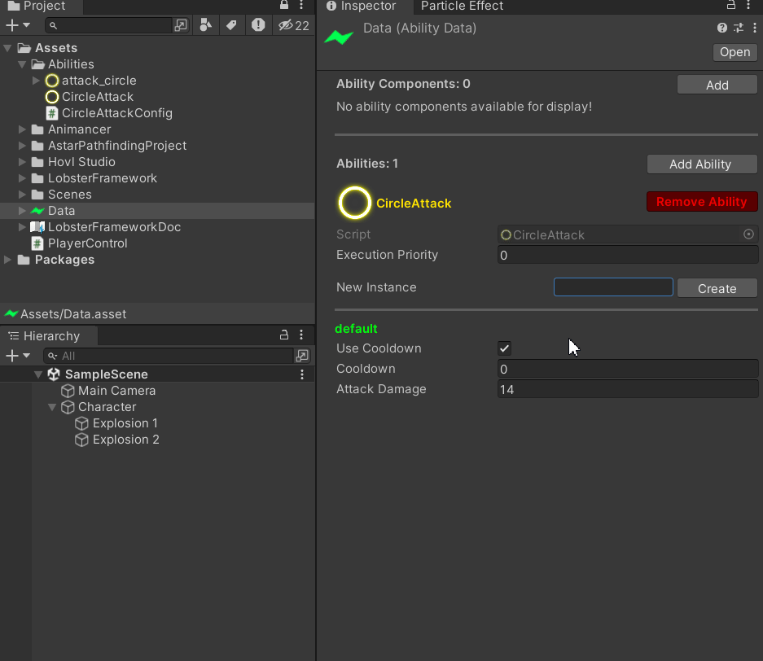
Now that we have 2 configurations for our ability, it is important to know how to invoke each of them. We'll modify our player control script as follows:
```
using LobsterFramework.AbilitySystem;
using UnityEngine;
using UnityEngine.InputSystem;

public class PlayerControl : MonoBehaviour
{
    [SerializeField] private AbilityManager abilityManager;
    public void Attack1(InputAction.CallbackContext context) {
        if (context.started) {
            abilityManager.EnqueueAbility<CircleAttack>("default");
        }
    }

    public void Attack2(InputAction.CallbackContext context)
    {
        if (context.started)
        {
            abilityManager.EnqueueAbility<CircleAttack>("instance2");
        }
    }
}
```
`AbilityManager.EnqueueAbility<T>(string)` takes in a string parameter as the identifier to the ability configuration you wish to cast the ability with. By default it is 'default' when called without arguments for convenience. Here we have finished the setup of wiring player input mouse left key to `Attack1()` and mouse right key to `Attack2()`. Since we want them to differ in the color of the particles being played out, we will add another property to `CircleAttackConfig`.
```
using LobsterFramework.AbilitySystem;
using UnityEngine;

public class CircleAttackConfig : AbilityConfig {
    public int AttackDamage;
    public Color color; 
}
```
### Acquire Component Reference
Now we will need the reference to the particle system component attached to the character. Since we're asking for references to scene object, we cannot serialize them on an asset object. The simpliest way would be to use `Component.GetComponent()` on `Ability.abilityManager` as they're on the same game object. However this may not always be the case and this appoach would fail when the component is located elsewhere. Instead, we will use `RequireComponentReferenceAttribute` to achieve this goal:
```
using LobsterFramework;
using LobsterFramework.AbilitySystem;
using UnityEngine;

[AddAbilityMenu]
[RequireComponentReference(typeof(ParticleSystem))]
public sealed class CircleAttack : Ability
{
    protected override bool Action()
    {
        CircleAttackConfig config = Config as CircleAttackConfig;
        Debug.Log($"Attack for damage {config.AttackDamage}!");
        /* Code to deal damage to the enemy */
        return false; 
    }
}

public class CircleAttackChannel : AbilityChannel { }
public class CircleAttackContext : AbilityContext { }
```
The `AbilityManager` and `AbilityData` inherits from `ReferenceProvider` and `ReferenceRequester`, therefore it is able to utilize editor support for abilities with `RequireComponentReferenceAttribute`.
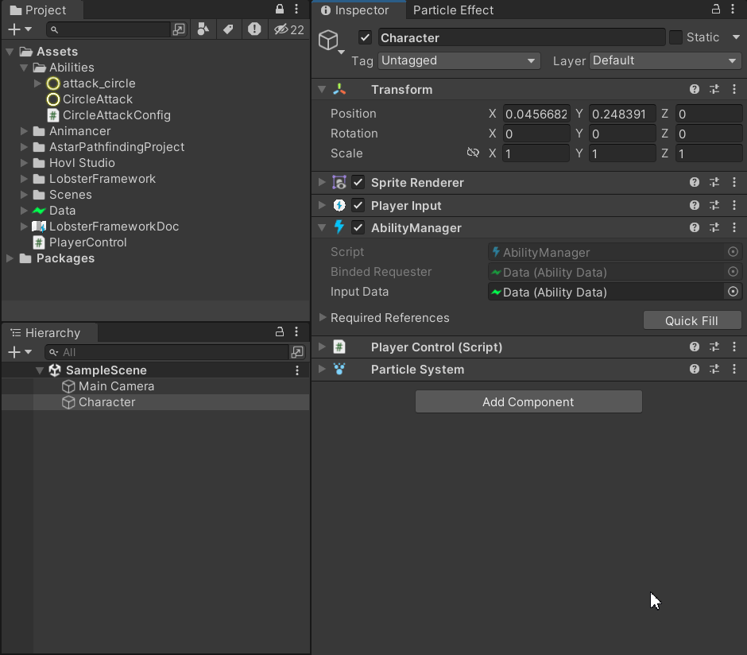
Note that once we apply this attribute the ability system will check if the field is null when entering the play mode. If the any of the required field is null for this ability a warning will be thrown and it may not be casted at runtime. Now we are prepared to modify `CircleAttack` to change the color of the particle system and play the particle effect. To access this reference, use `Ability.GetComponentReference<T>()`:
```
using LobsterFramework;
using LobsterFramework.AbilitySystem;
using UnityEngine;

[AddAbilityMenu]
[RequireComponentReference(typeof(ParticleSystem))]
public sealed class CircleAttack : Ability
{
    private ParticleSystem particleSystem;
    protected override void InitializeSharedReferences()
    {
        particleSystem = GetComponentReference<ParticleSystem>();
    }

    protected override bool Action()
    {
        CircleAttackConfig config = Config as CircleAttackConfig;
        var main = particleSystem.main;
        main.startColor = config.color;
        particleSystem.Play();
        Debug.Log($"Attack for damage {config.AttackDamage}!");
        /* Code to deal damage to the enemy */
        return false; 
    }
}

public class CircleAttackChannel : AbilityChannel { }
public class CircleAttackContext : AbilityContext { }
```
### Initialization & Finalization Routines
Since the component reference is shared among all ability instances, we can declare it as a property inside `CircleAttack` directly. `Ability.InitializeSharedReferences()` provides a routine for us to initialize any of these references when the [ability manager](#abilitymanager) is enabled. Conversly, we also have `Ability.FinializeSharedReferences()` to allow for any clean up operations such as unsubscribing from events. For temporary fields that are specific to each ability instance defined in [ability context](#abilitycontext) requiring initialization, we have `Ability.InitializeContext()` and `Ability.FinalizeContext()` for this purpose. Here's the result when we run the game:
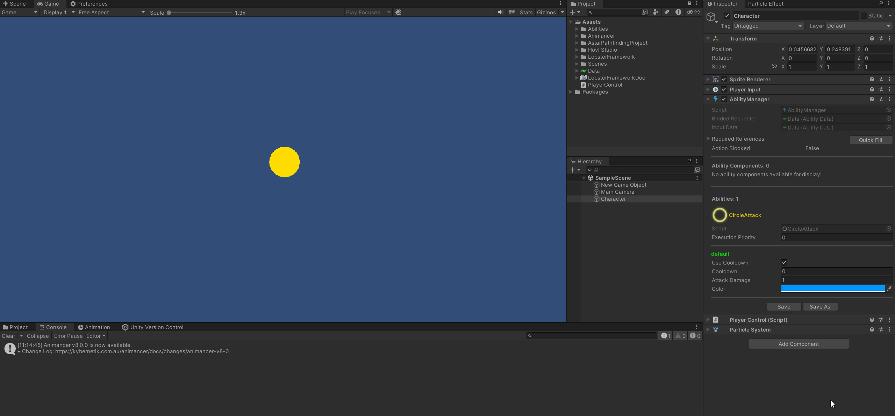

## Example 3
### Edit Multiple Abilities In The Inspector
We need to define another ability for this part of the demonstration. Continuing from our last example, let us define `SweepAttack` that does almost exactly the same thing as `CircleAttack` to keep things simple:
```
// SweepAttack.cs
using LobsterFramework;
using LobsterFramework.AbilitySystem;
using UnityEngine;

[AddAbilityMenu("Example")]
[RequireComponentReference(typeof(ParticleSystem), "Particle VFX", "The particle vfx that will be played when the ability is invoked")]
public sealed class SweepAttack : Ability
{
    private ParticleSystem particleSystem;
    protected override void InitializeSharedReferences()
    {
        particleSystem = GetComponentReference<ParticleSystem>();
    }

    protected override bool Action()
    {
        SweepAttackConfig config = Config as SweepAttackConfig;
        var main = particleSystem.main;
        main.startColor = config.color;
        particleSystem.Play();
        Debug.Log($"Sweep Attack: {config.AttackDamage}!");
        /* Code to deal sweep damage to the enemy */
        return false;
    }
}

public class SweepAttackChannel : AbilityChannel { }
public class SweepAttackContext : AbilityContext { }
```
```
// SweepAttackConfig.cs
using LobsterFramework.AbilitySystem;
using UnityEngine;

public class SweepAttackConfig : AbilityConfig
{
    public int AttackDamage;
    public Color Color;
}
```
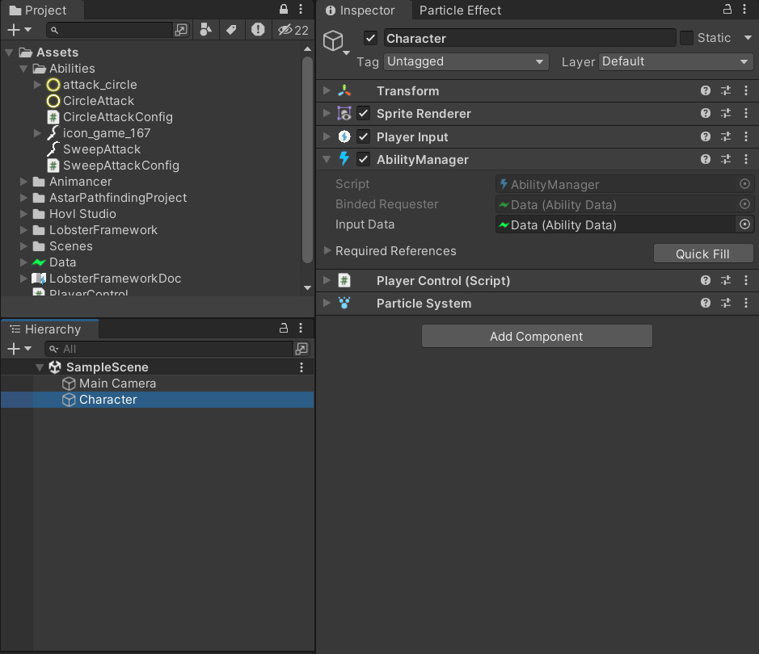
The above demonstrates how multiple abilities can be edited using the inspector. Note that you can pass multiple arguments to the `RequireComponentReferenceAttribtue` to customize the name and tooltip of the exposed property fields.

### Ability Component
As previously stated in the design goals, abilities should be able to have access to a shared resource. A simple way to implment this is by adding a property that stores the reference to a shared data object to each ability. However, this approach can fail if any of the reference is forgotten to be assigned and manually doing these assignments is cumbersome and error prone. We will see later on how editor support can help with alleviating this problem. In `LobsterFramework`, the sharing of resources between [abilities](#ability) is implemented via [AbilityComponent](#ability-component). 

In the previous step, we defined `SweepAttack` and its config `SweepAttackConfig` the same as `CircleAttack` and `CircleAttackConfig`. Now suppose we want these 2 abilities' damage to be affected by the same data asset, we can do this by defining `ChampionStat` as follows:
```
using LobsterFramework.AbilitySystem;

[AddAbilityComponentMenu("Example")]
public sealed class ChampionStat : AbilityComponent
{
    public int AttackDamage;
}
```
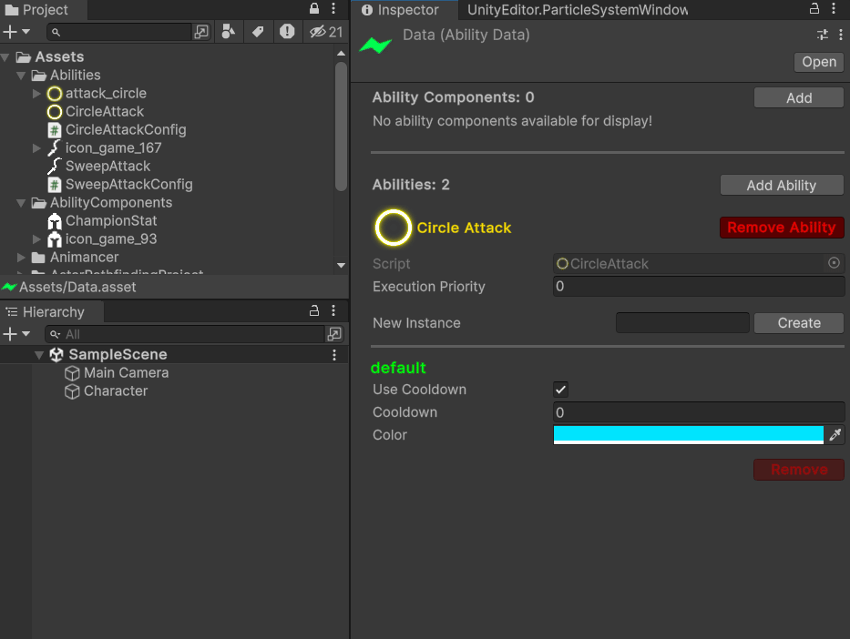
And we remove the field `AttackDamage` from both `CircleAttackConfig` and `SweepAttackConfig` as they're no longer needed. To access `ChampionStat`, use `Ability.GetAbilityComponent`:
```
// CircleAttack.cs
using LobsterFramework;
using LobsterFramework.AbilitySystem;
using UnityEngine;

[AddAbilityMenu("Example")]
[RequireComponentReference(typeof(ParticleSystem))]
public sealed class CircleAttack : Ability
{
    private ParticleSystem particleSystem;
    private ChampionStat stat;
    protected override void InitializeSharedReferences()
    {
        particleSystem = GetComponentReference<ParticleSystem>();
        stat = GetAbilityComponent<ChampionStat>();
    }

    protected override bool Action()
    {
        CircleAttackConfig config = Config as CircleAttackConfig;
        var main = particleSystem.main;
        main.startColor = config.Color;
        particleSystem.Play();
        Debug.Log($"Circle Attack: {stat.AttackDamage}!");
        /* Code to deal damage to the enemy */
        return false; 
    }
}

public class CircleAttackChannel : AbilityChannel { }
public class CircleAttackContext : AbilityContext { }
```
### Enforce the Requirement
The ability system features `RequireAbilityComponentAttribute` to allow the custom inspector to help developers to enforces the `AbilityComponent` requirements by abilities. When attempting to remove an `AbilityComponent` from `AbilityData`, the editor script will check the number of abilities relying on it. The operation will only be carried out once the script has verified that number is 0, otherwise an error will be displayed in the console, indicating which abilities depend on it:
```
// CircleAttack.cs
using LobsterFramework;
using LobsterFramework.AbilitySystem;
using UnityEngine;

[AddAbilityMenu("Example")]
[RequireComponentReference(typeof(ParticleSystem))]
[RequireAbilityComponent(typeof(ChampionStat))]
public sealed class CircleAttack : Ability
{
    /*...*/
}
```
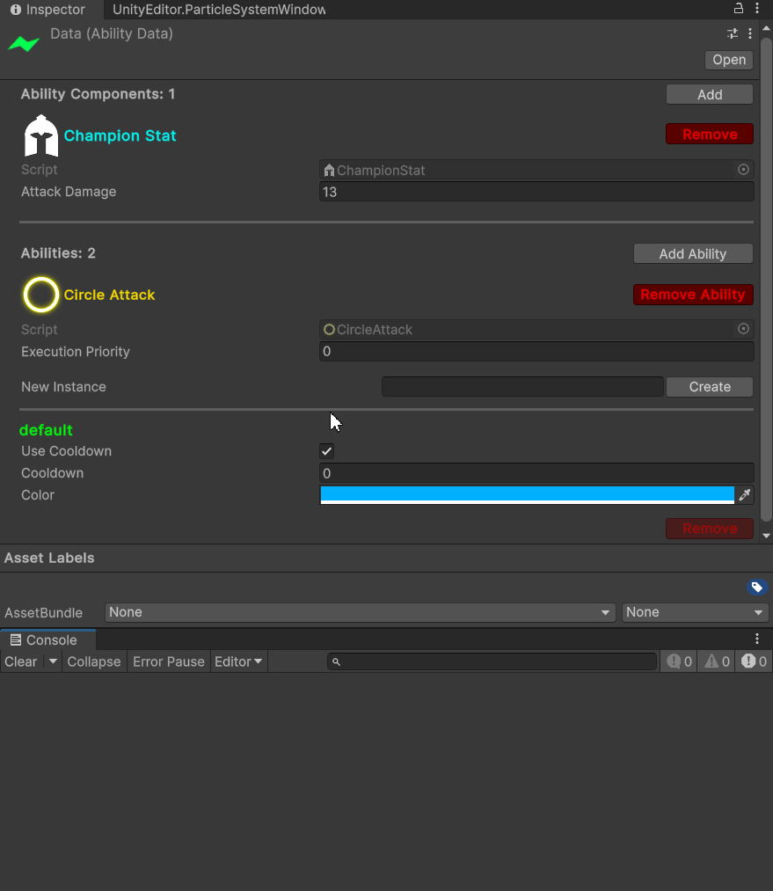
Conversely, when attempting to add an ability when its requirements are not satisfied, an error will be displayed:
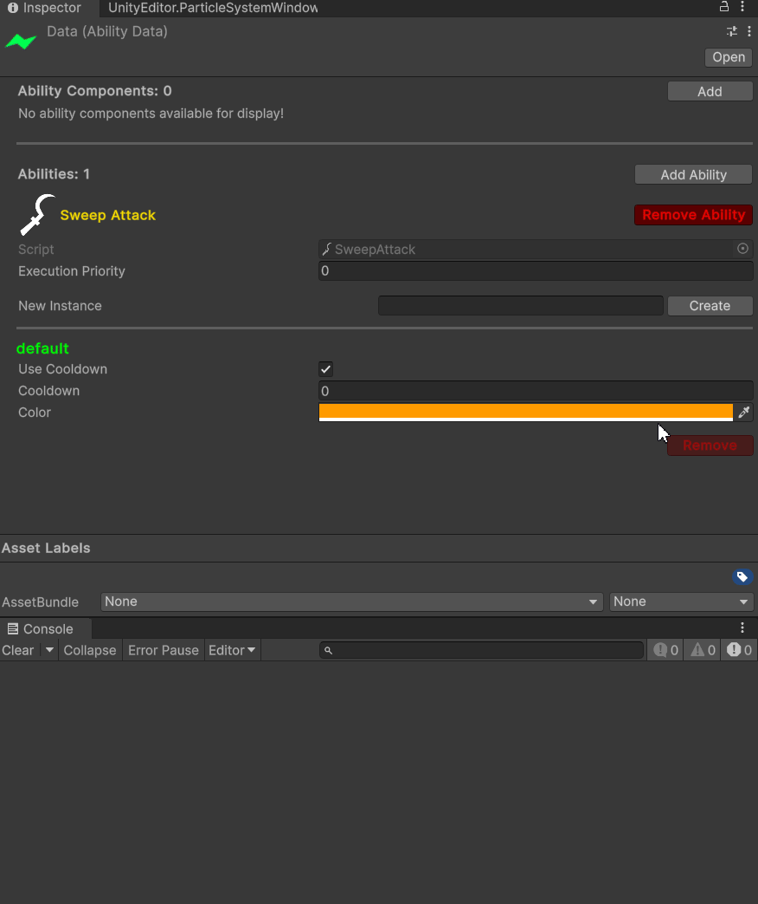
If new requirements have been added for the ability, the validation process will automatically add the missing ability components and display warning on the console. This is displayed as warning to notify the developer of any potential asset corruption.

## Example 4
### Ability Condition
The ability system has built in support for verifying ability cooldowns. However, developers are allowed to make their own customized rules about when the ability can be executed. Here's an example of using `Ability.ConditionSatisfied()` to implement `Fireball`:
```
// Fireball.cs
[AddAbilityMenu]
[RequireComponentReference(typeof(Mana))]
public sealed class Fireball : Ability {
    private Mana manaComponent;

    protected override void InitializeSharedReferences(){
        manaComponent = GetComponentReference<Mana>();
    }

    protected override bool ConditionSatisfied(){
        // Only allowed to cast fireball if the mana cost can be satisfied
        FireballConfig config = Config as FireballConfig;
        return manaComponent.mana >= config.cost;
    }

    protected override bool Action(){
        /* Code to control fireball */
    }
}
```
```
// FireballConfig.cs
public class FireballConfig : AbilityConfig{
    public int cost;
}
```
```
// Mana.cs
public class Mana : Monobehavior {
    public int mana;
}
```

### Prepare & Reset Ability Context
Sometimes there are actions you want to perform once before and after the ability execution, like playing ability animation and deduct the cost of the ability. These can be done by overriding `Ability.OnAbilityEnqueue` and `Ability.OnAbilityFinish`:
```
// Fireball.cs
[AddAbilityMenu]
[RequireComponentReference(typeof(Mana))]
public sealed class Fireball : Ability {
    private Mana manaComponent;

    protected override void InitializeSharedReferences(){
        manaComponent = GetComponentReference<Mana>();
    }

    protected override bool ConditionSatisfied(){
        // Only allowed to cast fireball if the mana cost can be satisfied
        FireballConfig config = Config as FireballConfig;
        return manaComponent.mana >= config.cost;
    }

    protected override void OnAbilityEnqueue(){
        FireballConfig config = Config as FireballConfig;
        manaComponent.mana -= config.cost;
        /* Code to play control fireball animation */
    }

    protected override bool Action(){
        /* Code to control fireball */
    }

    protected override void OnAbilityFinish(){
        /* Code to switch to walk animation */
    }
}
```
### Signal Ability
Oftentimes we want to make use of animation events to make sure the game logic is synchronized with the animation, for this use case, use `AbilityManager.Signal(AnimationEvent)` and implement `Ability.OnSignaled(AnimationEvent)`. Additionally, you can also use parameterless `AbilityManager.Signal<T>()` and implement `Ability.OnSignaled()` to implement signals issued by code. Continue using the example, the `Fireball` will be more powerful when we signal it:
```
// Fireball.cs
[AddAbilityMenu]
[RequireComponentReference(typeof(Mana))]
public sealed class Fireball : Ability {
    private Mana manaComponent;

    protected override void InitializeSharedReferences(){
        manaComponent = GetComponentReference<Mana>();
    }

    protected override bool ConditionSatisfied(){
        // Only allowed to cast fireball if the mana cost can be satisfied
        FireballConfig config = Config as FireballConfig;
        return manaComponent.mana >= config.cost;
    }

    protected override void OnAbilityEnqueue(){
        FireballConfig config = Config as FireballConfig;
        manaComponent.mana -= config.cost;
        /* Code to play control fireball animation */
    }

    protected override bool Action(){
        FireballContext context = Context as FireballContext;
        if(context.isEmpowered){
            /* Code to make fireball bigger if not already */
        }

        /* Code to control fireball */
    }

    protected override void OnSignaled(AnimationEvent){
        FireballContext context = Context as FireballContext;
        context.isEmpowered = true;
    }

    protected override void OnAbilityFinish(){
        FireballContext context = Context as FireballContext;
        context.isEmpowered = false;

        /* Code to switch to walk animation */
    }
}

public class FireballContext : AbilityContext {
    bool isEmpowered;
}
```

### Interrupt & Stop Ability
To stop the execution of an ability instance, use `AbilityManager.SuspendAbilityInstance<T>(string)` or `Ability.SuspendInstance(string)` while in the [context methods](#context-methods). 
To stop the execution of all instances of an ability, use `AbilityManager.SuspendAbility<T>()` or `Ability.SuspendAll()` while in the [context methods](#context-methods).
To stop the execution of all abilities, use `AbilityManager.SuspendAbilities()`.

The effect will take place immediately, `Ability.OnAbilityFinished()` will be called and the query of the status of the ability instance will indicate the ability instance is no longer running. The following example script demonstrate how `Fireball` can be interrupted by characeter movement:
```
public class PlayerControl : MonoBehavior {
    [SerializeField] private AbilityManager abilityManager;
    public void Move(Vector 3 direction){
        abilityManager.SuspendAbilityInstance<Fireball>();
        /* In this context the following also works: 
                abilityManager.SuspendAbility<Fireball>() 
                abilityManager.SuspendAbilities()
        */

        /* Code to move in the specified direction */
    }
}
```
# Coroutine

# Glossary

## AbilityManager
Attach this component to the character to enable it to cast abilities. This component takes in an [AbilityData](#abilitydata) as input. Calls to enqueue, query, terminate, send event to and communication with abilities can only be done through this component during the `Update()` unity event.

## AbilityData
An asset object that defines a set of [Abilities](#ability) and [Ability Components](#abilitycomponent). Client code should not interact with objects of this type directly. Can be edited using inspector.

## AbilityComponent
An asset object that defines a resource shared by all abilities. References can be obtained via `AbilityManager.GetAbilityComponent<T>()`.

## Ability
An asset object that defines an ability in the Ability System. Client code should not directly interact with ability objects. To create new abilities, you must subclass it and implement the [required methods](#mandatory). It comes with 3 complimentary classes that you must define: [AbilityConfig](#abilityconfig), [AbilityChannel](#abilitychannel), [AbilityContext](#abilitycontext). 

### Mandatory:
The following must be implemented
- `bool Action()`
### Optional:
The following can be overriden but are not required to do so
- `void InitializeSharedReferences()`
- `void FinalizeSharedReferences()`
- `void InitializeContext()`
- `void FinalizeContext()`
- `bool ConditionSatisfied()`
- `void OnAbilityEnqueue()`
- `void OnAbilityFinish()`
- `void OnSignaled(AnimationEvent)`
- `void OnSignaled()`
### Context Methods:
These methods have access to variables (not null): `Ability.Config`, `AbilityChannel` and `AbilityContext`
- `bool Action()`
- `void InitializeContext()`
- `void FinalizeContext()`
- `bool ConditionSatisfied()`
- `void OnAbilityEnqueue()`
- `void OnAbilityFinish()`
- `void OnSignaled(AnimationEvent)`
- `void OnSignaled()`
### Actions:
- `T GetComponentReference<T>()`
- `T GetAbilityComponent<T>()`
- `AnimancerState StartAnimation(AnimationClip, float)`
- `bool SuspendInstance(string)`
- `void SuspendAll()`
- `bool JoinAsSecondary<T>(string)`
- `bool JoinAsSecondary(Type, string)`

## AbilityConfig
An asset object that defines the setting of the ability. Only accessible while in the [context methods](#context-methods). A new ability needs to define **{#NameOfAbility}Config** that inherit from this class or its parent's config class if there's one.

## AbilityChannel
Allows client code to communicate with the ability when it is being runned. Accessible via `AbilityManager.GetAbilityChannel<T>()` where `T` is the type of the ability this channel type belongs and while in the [context methods](#context-methods) . A new ability needs to define **{#NameOfAbility}Channel** that inherit from this class or its parent's channel class if there's one. Do not define constructors for this class as the system uses reflection to call the default parameterless constructor. For custom initialization see `Ability.InitializeContext()`.

## AbilityContext
Stores context variables use by the ability during its execution. Only accessible while in the [context methods](#context-methods). A new ability needs to define **{#NameOfAbility}Context** that inherit from this class or its parent's context class if there's one. Do not define constructors for this class as the system uses reflection to call the default parameterless constructor. For custom initialization see `Ability.InitializeContext()`.